# Threat Hunt Report: Virtual Machine Compromise

## Platforms and Languages Leveraged
- EDR Platform: Microsoft Defender for Endpoint
- Kusto Query Language (KQL)

##  Scenario

INCIDENT BRIEF - Azuki Import/Export - 梓貿易株式会社
SITUATION:
Competitor undercut our 6-year shipping contract by exactly 3%. Our supplier contracts and pricing data appeared on underground forums.

COMPANY:
Azuki Import/Export Trading Co. - 23 employees, shipping logistics Japan/SE Asia

COMPROMISED SYSTEMS:

AZUKI-SL (IT admin workstation)

DeviceProcessEvents
| where DeviceName == "azuki-sl"
| where Timestamp between (datetime(2025-11-19) .. datetime(2025-11-20))

---

## Steps Taken

### Flag 1 + 2. Searched the `DeviceLogonEvents` Table

The investigation focuses on identifying how an attacker gained initial access through Remote Desktop Protocol (RDP).

Flag 1 – Source IP:
By analysing DeviceLogonEvents for remote/interactive logons from external locations during the incident, the suspicious RDP connection is traced back to the IP address 88.97.178.12.

Flag 2 – Compromised Account:
By correlating the RDP logon event with the timestamp and authentication details, the compromised user account used for initial access is identified as kenji.sato.

**Query used to locate events:**

```kql

DeviceLogonEvents
| where DeviceName == "azuki-sl"
| where Timestamp between (datetime(2025-11-19) .. datetime(2025-11-20))
| where ActionType contains "LogonSuccess"
| project RemoteIP, AccountName

```
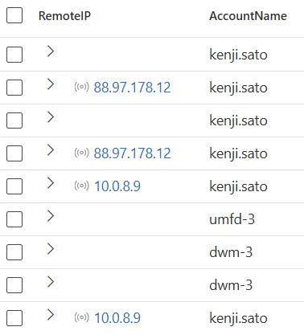

---

### Flag 3. Searched the `DeviceProcessEvents` Table

Flag 3 focuses on detecting network reconnaissance activity performed by the attacker after initial access. Attackers often run commands that reveal local network devices and their MAC addresses to plan lateral movement.
By analysing DeviceProcessEvents for enumeration tools executed after the compromise, the command used for network neighbour discovery is identified as:

"ARP.EXE" -a

This indicates the attacker used the ARP utility to list devices on the local network.

**Query used to locate events:**

```kql

DeviceProcessEvents
| where FileName contains "arp"
| where DeviceName == "azuki-sl"


```
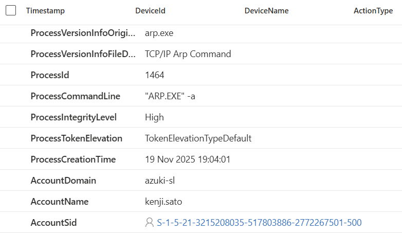

---

### Flag 4. Searched the `DeviceProcessEvents` Table

Flag 4 focuses on identifying the malware staging directory created by the attacker. Threat actors often make hidden directories within system folders to store tools, payloads, and stolen data. By examining events involving directory creation (mkdir/New-Item) followed by attribute changes (attrib), the investigation identifies the attacker’s primary staging location as:

C:\ProgramData\WindowsCache

This hidden folder served as the central storage location for malware and related artefacts.

**Query used to locate events:**

```kql

DeviceProcessEvents
| where ProcessCommandLine contains "attrib"
| project Timestamp, FileName, ProcessCommandLine
| order by Timestamp asc

```
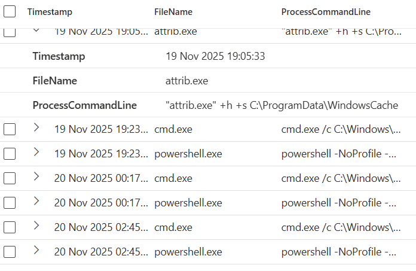

---

### Flag 5. Searched the `DeviceRegistryEvents` Table

Flag 5 examines how the attacker attempted to evade detection by modifying Windows Defender settings. Specifically, they added file extension exclusions so Defender would not scan certain types of files, allowing malware and tools to run undetected.

By reviewing DeviceRegistryEvents for changes to the Windows Defender Exclusions → Extensions registry key and counting the unique file extensions added during the attack, investigators determined that:

3 file extensions were excluded from Windows Defender scanning.

This highlights the attacker’s deliberate effort to weaken security controls.

**Query used to locate events:**

```kql

DeviceRegistryEvents
| where DeviceName == "azuki-sl"
| where RegistryKey contains "Extensions"


```
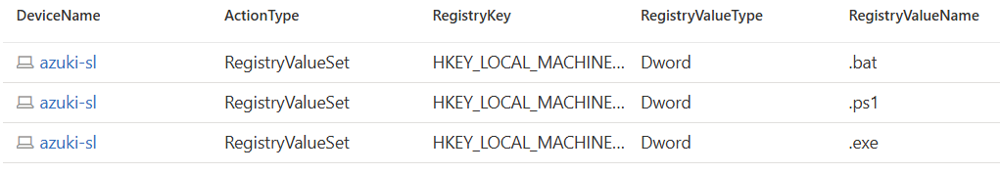

---


### Flag 6. Searched the `DeviceRegistryEvents` Table

Flag 6 identifies how the attacker further evaded detection by excluding an entire temporary folder path from Windows Defender scanning. By analysing DeviceRegistryEvents for modifications to the Windows Defender → Exclusions → Paths registry key, investigators found a temp directory added to the exclusion list. This allowed any malicious files placed there to run without being scanned.

The excluded folder path was:

C:\Users\KENJI~1.SAT\AppData\Local\Temp

This exclusion provided the attacker with a safe location to execute and store malicious tools.

**Query used to locate events:**

```kql

DeviceRegistryEvents
| where DeviceName == "azuki-sl"
| where RegistryKey contains "Paths"


```
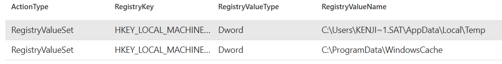

---


### Flag 7. Searched the `DeviceProcessEvents` Table

Flag 7 focuses on identifying a Windows-native utility that the attacker abused to download malicious files — a common “Living Off the Land” technique that avoids detection by using trusted system tools.
By reviewing DeviceProcessEvents for command lines showing downloads from URLs, investigators determined that the attacker used:

certutil.exe

This built-in certificate management tool can fetch files over the network, making it a popular choice for stealthy malware delivery.

**Query used to locate events:**

```kql

DeviceProcessEvents
| where DeviceName == "azuki-sl"
| where FileName contains "certutil.exe"

```
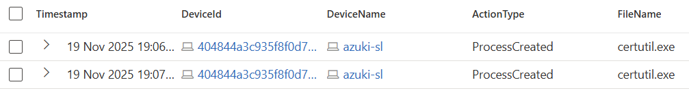

---

### Flag 8 + 9. Searched the `DeviceProcessEvents` Table

Flag 8 investigates persistence created by the attacker using a scheduled task. By analysing DeviceProcessEvents for schtasks.exe /create commands during the compromise, investigators identified that the attacker created a scheduled task named:

Windows Update Check

This name mimics legitimate Windows maintenance tasks to avoid suspicion.

Flag 9 focuses on the task’s target action, which reveals the exact malware or script executed for persistence. It can be found in the /tr parameter of the schtasks.exe command.

**Query used to locate events:**

```kql

DeviceProcessEvents
| where DeviceName contains "azuki-sl"
| where FileName contains "schtasks.exe"

```
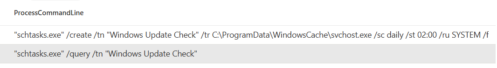

---

### Flag 10. Searched the `DeviceNetworkEvents` Table

Flag 10 focuses on identifying the Command and Control (C2) server that the attacker’s malware connected to after execution. By examining DeviceNetworkEvents for outbound connections made by the malicious process, investigators identified a suspicious external IP address acting as the remote control point.

The C2 server IP was:

78.141.196.6

This IP represents the attacker’s command-and-control infrastructure used to manage the compromised system.

**Query used to locate events:**

```kql

DeviceNetworkEvents
| where DeviceName == "azuki-sl"
| where ActionType contains "ConnectionSuccess"
| where RemotePort !in (80, 443)
| project RemoteIP

```
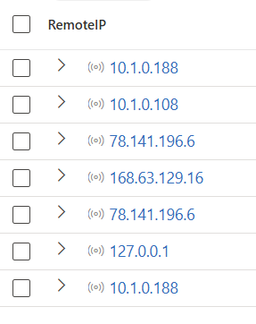

---

### Flag 11. Searched the `DeviceNetworkEvents` Table

Flag 11 identifies the destination port used by the attacker’s malware to communicate with the Command and Control (C2) server. By analysing DeviceNetworkEvents for outbound connections from the malicious process and checking the RemotePort field, investigators determined the port used for C2 communications:

443

This port, typically used for HTTPS, allows attackers to blend malicious traffic with normal encrypted web traffic, helping evade detection.

**Query used to locate events:**

```kql

DeviceNetworkEvents
| where DeviceName == "azuki-sl"
| where InitiatingProcessFileName contains "curl.exe"   // or the specific malware filename if known
| project Timestamp, InitiatingProcessFileName, RemoteIP, RemotePort, Protocol
| order by Timestamp asc


```
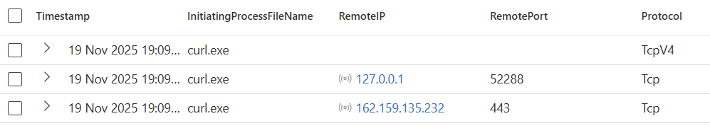

---

### Flag 12. Searched the `DeviceFileEvents` Table

Flag 12 focuses on identifying the credential theft tool used by the attacker. These tools are often renamed to short, inconspicuous filenames to evade detection. By reviewing files downloaded into the malware staging directory and correlating them with events involving access to LSASS memory, investigators determined that the attacker used a credential dumping tool named:

mm.exe

This shortened filename helped the attacker conceal the true nature of the tool while extracting credentials from the system.

**Query used to locate events:**

```kql

DeviceFileEvents
| where DeviceName == "azuki-sl"
| where ActionType == "FileCreated"
| where FileName endswith ".exe"
| project Timestamp, FolderPath, FileName
| order by Timestamp asc

```
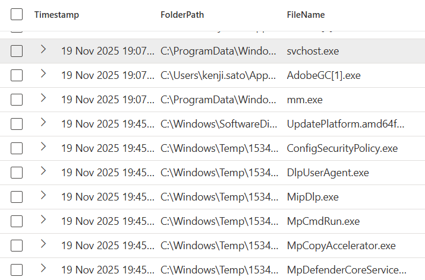

---


### Flag 13. Searched the `DeviceProcessEvents` Table

Flag 13 determines which Mimikatz module the attacker used to extract credentials from system memory. By analysing the command-line arguments passed to the credential dumping tool and looking for the typical module::command syntax, investigators identified that the attacker executed:

sekurlsa::logonpasswords

This module is specifically designed to pull logon passwords and authentication data directly from the LSASS process, confirming that the attacker used advanced credential theft techniques.

**Query used to locate events:**

```kql

DeviceProcessEvents
| where ProcessCommandLine contains "::"
| where DeviceName == "azuki-sl"
| project Timestamp, DeviceName, FileName, ProcessCommandLine

```
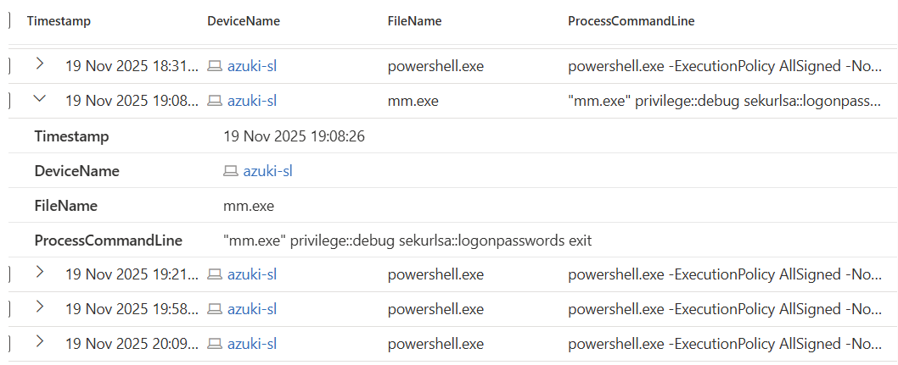

---


### Flag 14. Searched the `DeviceFileEvents` Table

Flag 14 identifies the archive file created by the attacker to package stolen data before exfiltration. By analysing activity in the staging directory—such as file creation events or the use of Compress-Archive—investigators determined that the attacker generated a ZIP file for data collection:

export-data.zip

This archive contains the gathered data that was later exfiltrated from the system.

**Query used to locate events:**

```kql

DeviceFileEvents
| where DeviceName contains "azuki-sl"
| where FileName contains ".zip"

```
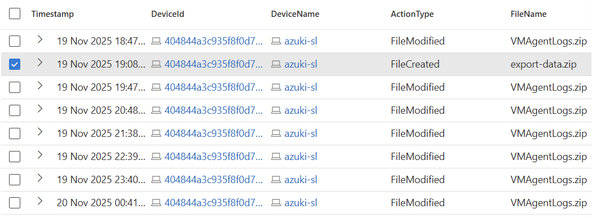

---

### Flag 15. Searched the `DeviceNetworkEvents` Table

Flag 15 identifies the cloud service the attacker used to exfiltrate stolen data. By reviewing DeviceNetworkEvents for outbound HTTPS traffic to common file‑sharing or communication platforms during the exfiltration phase, investigators determined that the attacker uploaded the archived data to:

Discord

This indicates the attacker leveraged Discord’s file upload capabilities as their exfiltration channel.

**Query used to locate events:**

```kql

DeviceNetworkEvents
| where DeviceName == "azuki-sl"
| where RemoteUrl contains "Discord"

```
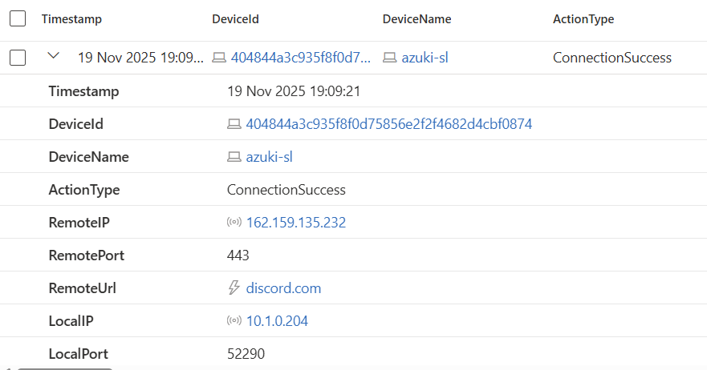

---

### Flag 16. Searched the `DeviceProcessEvents` Table

Flag 16 focuses on identifying which Windows event log the attacker cleared first as part of their anti‑forensics activity. By analysing process events late in the attack timeline—specifically executions of wevtutil.exe used to clear logs—investigators determined that the attacker initially targeted the:

Security log

Clearing the Security log first suggests the attacker intended to erase authentication and access traces before removing other evidence.

**Query used to locate events:**

```kql

DeviceProcessEvents
| where FileName =~ "wevtutil.exe"
| where ProcessCommandLine has "cl" or ProcessCommandLine has "clear-log"
| project Timestamp, DeviceName, FileName, ProcessCommandLine
| order by Timestamp asc


```
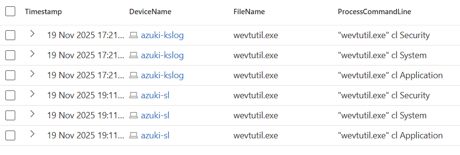

---

### Flag 17. Searched the `DeviceProcessEvents` Table

Flag 17 identifies the backdoor user account the attacker created to maintain long‑term access after the main intrusion. By analysing account creation commands executed during the impact phase—specifically those using /add and adding the new user to the Administrators group—investigators determined that the attacker created a hidden persistence account with the username:

support

This account would allow the attacker to regain access even after other remediation steps.

**Query used to locate events:**

```kql

DeviceProcessEvents
| where DeviceName == "azuki-sl"
| where ProcessCommandLine contains "net"

```
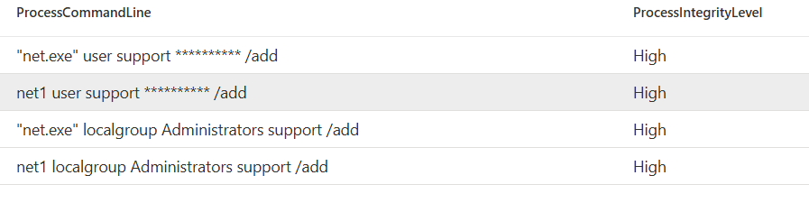

---

### Flag 18. Searched the `DeviceFileEvents` Table

Flag 18 identifies the malicious PowerShell script used by the attacker to automate parts of the intrusion. By analysing DeviceFileEvents for script files created in temporary directories early in the attack—especially PowerShell scripts downloaded from external sources—investigators determined that the attacker used:

wupdate.ps1

This script served as the automation entry point for executing subsequent stages of the attack chain.

**Query used to locate events:**

```kql

DeviceFileEvents
| where DeviceName == "azuki-sl"
| where ActionType == "FileCreated"
| where FileName endswith ".ps1"
| project Timestamp, FileName, FolderPath, InitiatingProcessFileName, InitiatingProcessCommandLine
| order by Timestamp asc

```
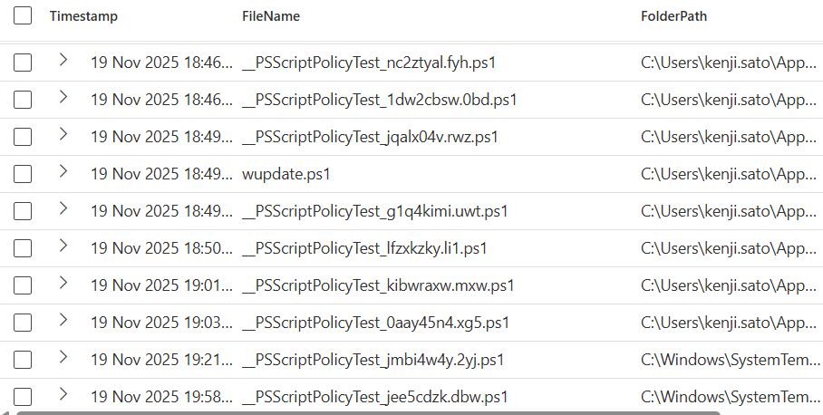

---

### Flag 19 + 20. Searched the `DeviceProcessEvents` Table

Flag 19 identifies the secondary system the attacker attempted to access during lateral movement. By analysing remote access commands—such as cmdkey or mstsc—executed late in the attack timeline, investigators determined the internal IP address the attacker targeted:

10.1.0.188

This reveals the attacker’s next intended pivot point within the network.

Flag 20 identifies the remote access tool the attacker used to move laterally within the network. By analysing process events near the end of the attack timeline—specifically those involving remote system names or IP addresses—investigators confirmed that the attacker used the built‑in Windows Remote Desktop client:

mstsc.exe

This legitimate tool helps attackers blend their activity with normal administrative behaviour, making detection more difficult.

**Query used to locate events:**

```kql

DeviceProcessEvents
| where DeviceName == "azuki-sl"
| where FileName =~ "mstsc.exe"
| project Timestamp, FileName, ProcessCommandLine
| order by Timestamp asc


```
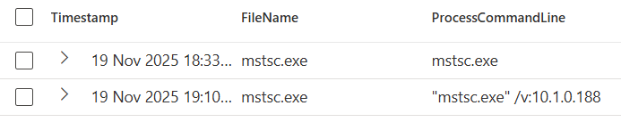

---

##  Event Timeline 

### 1. Initial Access

1. External RDP Break‑in

Attacker IP: 88.97.178.12

Compromised account: kenji.sato
The attacker successfully logged into the system via RDP using stolen credentials.

### 2. Host Reconnaissance

2. Network Device Discovery

Executed: arp -a
Used to enumerate devices on the local network for potential lateral movement.

### 3. Establishing Foothold & Staging

3. Created Hidden Malware Staging Folder

Folder: C:\ProgramData\WindowsCache
Used to store malware, tools, and collected data.

### 4. Defense Evasion

4. Manipulated Windows Defender

Added 3 file extensions to Defender exclusions.

Excluded path: C:\Users\KENJI~1.SAT\AppData\Local\Temp
This allowed attacker tools to run undetected.

5. Used Living‑off‑the‑Land Binary for Downloading

Tool abused: certutil.exe
Used to download malicious payloads.

### 5. Persistence

6. Created a Fake Windows Update Scheduled Task

Task name: Windows Update Check

Persistence mechanism executed via schtasks.

7. Created a Backdoor Administrator Account

Username: support
Ensured long‑term access even after cleanup.

### 6. Command & Control

8. Malware Beaconed Out to C2 Server

C2 IP: 78.141.196.6

Port used: 443 (blends into normal HTTPS traffic)

### 7. Credential Theft

9. Credential Dumper Identified

File: mm.exe
Likely renamed Mimikatz.

10. Mimikatz Module Used

sekurlsa::logonpasswords
Extracted passwords and authentication tokens from LSASS.

### 8. Collection & Exfiltration

11. Archive Created for Stolen Data

File: export-data.zip

12. Exfiltration Channel Used

Discord
Data was uploaded to the Discord CDN.

### 9. Anti‑Forensics

13. Logs Cleared

First log cleared: Security Log
Indicates attacker priority to hide authentication evidence.

### 10. Lateral Movement Attempt

14. Targeted Internal System

IP: 10.1.0.188

15. Tool Used for Lateral Movement

mstsc.exe (Windows RDP client)

---

## Summary

The attacker entered the system via RDP using stolen credentials, performed reconnaissance, established persistence, downloaded malware using certutil, communicated with a C2 server over port 443, dumped credentials with Mimikatz, staged and exfiltrated data to Discord, cleared logs to hide their tracks, created a backdoor user account, and then attempted lateral movement to another host.

---

